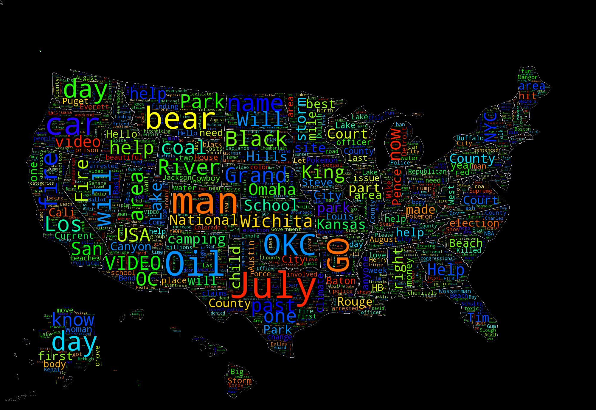

# blackboard

Tool to make wordclouds in the shape of states and assemble them into US maps

##Requirements

 * Python 3
 * Pygame
 * Wordcloud
 * imagemagick
 * linux, probably
 * flask
 * PIL (or pillow)
 * PRAW

##Usage
You can use `run.sh buildmap reddit` to generate a big-ol png map from reddit, or you can run liveserver.py to constantly refresh the stateclouds and provide a live web visualization at localhost:5000/sv/index.htm

To use the `twitter_search` backend you'll need to create a `twitter_keys.json` file with the requisite constructor args for the twitter API.

You can also push live integrated map and metadata updates to a configured FTP server with `ftpworker.py` if you create a `sc` folder on the server, upload the contents of the `server_viz` directory, and configure the account to start in the correct directory on login

I might add some real docs at some point, the whole things pretty quick-and-dirty

##Example
A running live web example is availible at [blackboard.zapflame.com](http://blackboard.zapflame.com)

